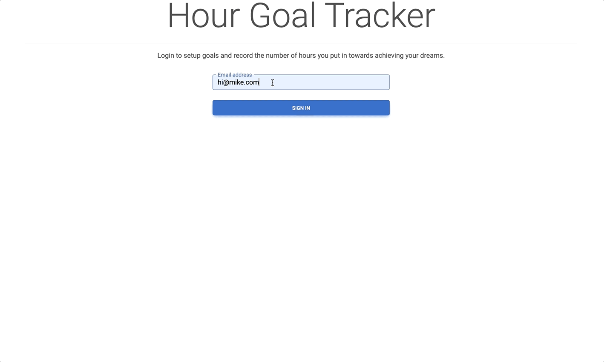

# Hour Goal Tracker
This app is for users to track hours spent towards their goals. 
Sometimes we as humans are a terrible at judging how many hours we ACTUALLY put into working on our goals.
If we actually track the hours, we'll have more accountability and likely achieve more progress. 

# What does this app do?
Lets you create an account (via email address or unique string)
Lets you create goals and record your time spent on the goal. 
Visit App here: https://up9psjypvd.us-east-1.awsapprunner.com/ (this might not work if I decided to take the app down)

# What it looks like:


# The Tech Stack
**Frontend:**
* React 18.2.x
* React Router 6.8.x
* MDB Bootstrap (ui elements)
* Dockerized and deployed to AWS App Runner

**Backend:**
* Spring boot 3.0.x
* AWS DynamoDB
* Dockerized and deployed to AWS App Runner
* Written in 100% TDD style of development

# How to run locally?
1. First run the backend
2. Then run the frontend

#### Step 1 Local Backend:

Since this app uses [dynamodb](https://aws.amazon.com/dynamodb/) as the datastore, we need dynamodb available locally (so we don't have to spend $ on the cloud one just for running this app locally)

##### Setup Local Dynamodb:
Prereq: You'll need docker up and running locally
Then execute this to run the dynamodb docker container on port 8000
```
docker run --detach -p 8000:8000 amazon/dynamodb-local
```

Now create the dynamodb table needed for this application: (you'll need [AWS cli](https://docs.aws.amazon.com/cli/latest/userguide/getting-started-install.html) installed for this part)
```
aws dynamodb create-table --table-name hour-goal-tracker --attribute-definitions AttributeName=userId,AttributeType=S --key-schema AttributeName=userId,KeyType=HASH --provisioned-throughput ReadCapacityUnits=1,WriteCapacityUnits=1 --endpoint-url http://localhost:8000
```
Now see if it worked by listing the tables:
```
aws dynamodb list-tables --endpoint-url http://localhost:8000

You should see:
{
    "TableNames": [
        "hour-goal-tracker"
    ]
}
```

To run the spring boot backend app first navigate to the backend directory on your cloned code:
```
cd hour-goal-tracker/backend
```

Run the application locally with the maven wrapper (you'll need Java 17 installed first) Here is a the [brew link if you use a mac](https://formulae.brew.sh/formula/openjdk@17)

```
./mvnw spring-boot:run -Dspring-boot.run.jvmArguments="-Ddynamodb.local.endpoint=http://localhost:8000"
```
Note: ^ We're passing the Java property `dynamodb.local.endpoint` to tell our app to point to a local dynamodb instance

Now check that your backend application is up and running by visiting http://localhost:8080/actuator/health, you can see the health say `UP`.


#### 2. Frontend:

First you need to clone or download the zip of this github repo
```                                                                                                            
git clone https://github.com/goshipcode/hour-goal-tracker.git                                               
```                                                                                                            

Navigate into this repo's frontend directory on your computer:
```                                                                                                            
cd hour-goal-tracker/frontend                                                                                 
```                                                                                                            

Install the app with `npm` (If you don't have npm, then [install nodejs here](https://nodejs.org/en/download/))
```                                                                                                            
npm install                                                                                                    
``` 

Now run the app with npm
```                                                                                                            
npm start                                                                                                    
``` 

Navigate to http://localhost:3000/ to see the application!


# Deployment to AWS
I deployed the frontend and backend to [AWS App Runner](https://aws.amazon.com/apprunner/) that just takes a container and runs it for you. 
I deployed using the handy [copilot cli](https://aws.amazon.com/containers/copilot/)

You can see the copilot config files in this repo [backend here](./backend/copilot), and [frontend here](./frontend/copilot). 

I have not tried this, but you should be able to deploy these applications yourself to AWS app runner with copilot by 
cloning this repo and executing the following: 

From the frontend directory:
```
cd frontend
copilot svc deploy
```

From the backend: (Note Prereq: you'll need to add your aws account id for the dynamodb table arn in [this file](./backend/copilot/hgt-backend/addons/mytable-ddb.yaml))
```
cd backend
copilot svc deploy
```
Please put an issue on this repo if this doesn't work. 

# What I learned during this project
* Dynamodb enhanced client using java aws sdk 2.0. I've always used the 1.0 dynamodb mapper before, so this was a new 
library I haven't used before. It seemed to be easy to use and setup, I'll be using it from now on.

* React Router passing props to the new page - [Link here](https://github.com/goshipcode/hour-goal-tracker/blob/main/frontend/src/components/LoginPage.js#L27)

* React [Lifting State up](https://beta.reactjs.org/learn/sharing-state-between-components) 
  By passing event handlers. Don't pass state objects down to child components, only pass static props, and event handlers!

